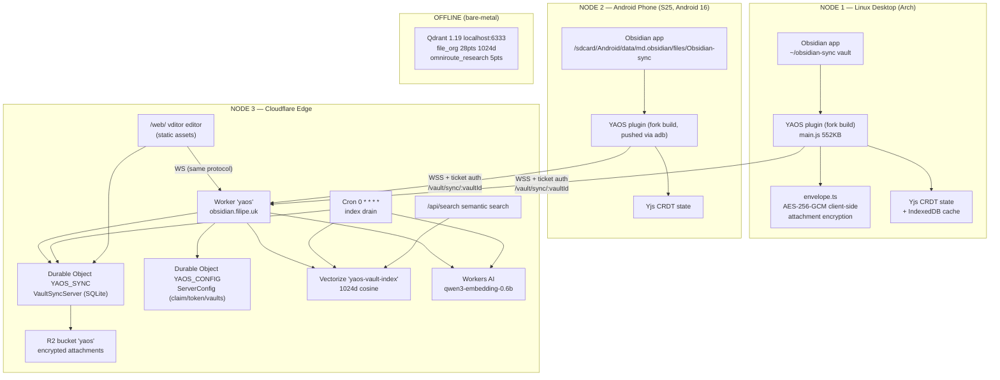
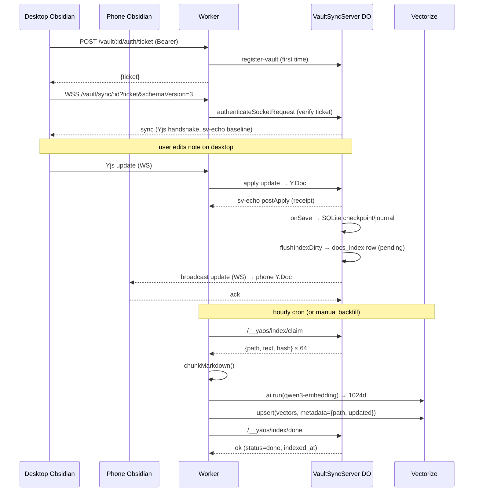

# YAOS Fork — Complete Engineering Documentation

> **Repo:** `filipe79bh/yaos_fork` (fork of `kavinsood/yaos`, 0-BSD license)
> **Documentation date:** 2026-08-13
> **Audience:** Any AI agent or engineer needing to review, understand, extend, or audit this system quickly.
> **Purpose:** Extreme detail — architecture, every custom fork feature, security/perf/crash analysis, and improvement roadmap.

---

## 0. TL;DR (what this system is)

A **zero-knowledge, self-hosted Obsidian sync + RAG + MCP stack** running on Cloudflare Workers, built as a fork of YAOS. Three nodes stay in continuous real-time sync:

1. **Cloudflare Worker `yaos`** at `https://obsidian.filipe.uk` — CRDT sync server (Durable Objects + SQLite), R2 attachment storage (client-side encrypted), web vault editor at `/web/`, semantic search (Vectorize + qwen3-embedding), hourly index cron.
2. **Linux desktop** (`~/obsidian-sync`, Arch Linux) — Obsidian + forked YAOS plugin (AES-256-GCM attachment encryption, telemetry disabled).
3. **Android phone** (Samsung S25, Android 16) — Obsidian + same forked plugin, same vault, real-time CRDT sync.

Plus: **local Qdrant** (v1.19, bare-metal systemd) with pre-existing embedding collections, used as an offline vector store companion.

All custom code is marked `// Fork ...` or lives in dedicated fork files: `src/crypto/envelope.ts`, `server/src/indexQueue.ts`, `server/src/indexer.ts`, `server/web-app/`, plus route/binding additions in `server/wrangler.jsonc` and `server/src/index.ts`.

---

## 1. Three-Node Architecture



### 1.1 The sync model (CRDT, not file sync)

```
┌─────────────┐     ┌──────────────┐     ┌──────────────────┐
│ Any device  │────▶│ YAOS Worker  │────▶│ VaultSyncServer  │
│ Yjs Y.Doc   │WS   │ ticket check │RPC  │ Durable Object   │
│ pathToId    │     │ bearer auth  │     │ Y.Doc (source of │
│ idToText    │◀────│ (5-min       │◀────│ truth) + SQLite  │
│ meta        │sync │  tickets)    │     │ checkpoint+journal│
│ pathToBlob  │     └──────────────┘     └──────────────────┘
└─────────────┘
```

- **Yjs CRDT**: all devices converge deterministically on the same vault state; no conflict files (unlike Obsidian Sync/Dropbox). Desktop ↔ phone ↔ web editor all share one `Y.Doc` per vault.
- **Content maps** (schema v3, "id-first" model — see `server/src/documentSummary.ts`):
  - `pathToId: Y.Map<string>` — vault path → stable fileId (legacy, frozen)
  - `idToText: Y.Map<Y.Text>` — fileId → markdown text
  - `meta: Y.Map` — fileId → { path, mtime, device, deleted? } (nested Y.Map values!)
  - `sys` — sentinel bookkeeping
  - `pathToBlob`, `blobMeta`, `blobTombstones` — attachments
- **Durability**: SQLite checkpoint + journal (`server/src/sqlDocStore.ts`), sv-echo receipts, tombstone reaper.
- **Attachments**: content-addressed by SHA-256 of plaintext; stored in R2 **encrypted** (custom fork feature).

### 1.2 Authentication flow (the ticket system)

```
Device ──POST /vault/:id/auth/ticket──▶ Worker (Bearer token)
        ◀─────────── {ticket, expiresAt} ──
Device ──WSS /vault/sync/:id?ticket=T&schemaVersion=3──▶ DO
        (ticket = HMAC-signed payload, 5-min TTL,
         base64url(JSON).base64url(HMAC-SHA256))
```

Why tickets: `WebSocket()` can't send custom headers, and putting the long-lived token in the URL would leak it into logs. Tickets are signed with a key derived from the claim secret (`server/src/routes/ticket.ts`, `deriveSigningKey`).

---

## 2. Custom Fork Features (everything we added to upstream)

| # | Feature | Files | Purpose |
|---|---------|-------|---------|
| F1 | **Telemetry/phone-home disabled** | `src/runtime/capabilityUpdateService.ts` | `UPDATE_MANIFEST_URLS = []` + no-op guard; repo refs → `filipe79bh/yaos_fork` |
| F2 | **Client-side AES-256-GCM attachment encryption** | `src/crypto/envelope.ts`, `src/sync/blobSync.ts` | Zero-knowledge R2: bytes encrypted before upload; key = HKDF(sync token); envelope `[ver=1][nonce 12][ct+tag]` |
| F3 | **Web Vault editor** | `server/web-app/` (web-vault.ts, index.html), `server/build-web-vault.mjs`, `server/src/index.ts` route `kind:"web"` | vditor editor at `/web/`, joins the same Yjs room as devices; static assets binding `WEB_ASSETS` |
| F4 | **Server receipt-echo fix** | `server/src/server.ts` `onSave()` + `broadcastSvEchoToConnections()` | After each durable save, broadcast sv-echo so clients confirm receipts (upstream only echoed on connect/update) |
| F5 | **RAG indexing queue** | `server/src/indexQueue.ts` (`VaultIndexStore`) | SQLite `docs_index` staging table in the DO; write-time snapshots; survives eviction |
| F6 | **Embed + upsert pipeline** | `server/src/indexer.ts` (`drainIndexQueue`) | chunk → `@cf/qwen/qwen3-embedding-0.6b` (1024d) → Vectorize upsert |
| F7 | **Hourly cron** | `server/wrangler.jsonc` `triggers.crons` + `scheduled` handler in `server/src/index.ts` | Auto-index new/changed notes |
| F8 | **Semantic search API** | `server/src/index.ts` `handleSearch` + route `kind:"search"` | `GET /api/search?q=` → embed → Vectorize query → paths+scores |
| F9 | **Vault registry** | `server/src/config.ts` (`VAULTS_KEY`, register-vault RPC) | Cron enumerates registered vaults |
| F10 | **Bulk backfill endpoint** | `server/src/index.ts` route `kind:"index-backfill"` | `POST /api/index/backfill` — resumable first-run load |

### 2.1 F1 — telemetry disabled (detail)

`src/runtime/capabilityUpdateService.ts`:
```ts
const UPDATE_MANIFEST_URLS = [] as const;   // was ["https://github.com/kavinsood/yaos/releases/..."]
```
Plus a guard in `refreshUpdateManifestInner` returning early when the list is empty, so the disabled check doesn't log fake failures. The updater workflow YAML and `server/src/setupPage.ts` `DEFAULT_DEPLOY_REPO` now point at `filipe79bh/yaos_fork`.

**Note:** the `src/telemetry/` directory is *local-only diagnostics* (flight recorder), it never sends data out — not real telemetry.

### 2.2 F2 — attachment encryption (detail)

`src/crypto/envelope.ts`:
```ts
// HKDF-SHA256(token, salt="yaos-fork:blob-encryption-salt-v1", info="yaos-fork:blob-aes-256-gcm-v1")
// → non-extractable AES-256-GCM key
// encrypt:  envelope = [version=1][nonce=12 bytes][ciphertext+GCM tag]
```
Hook points in `src/sync/blobSync.ts` (`BlobHttpClient`):
- `upload()`: `body = await this.crypto.encrypt(data)`; content type forced to `application/octet-stream` (hides file type from R2 metadata).
- `download()`: `return await this.crypto.decrypt(data)`.
- Content-addressing unchanged (hash of **plaintext**) → dedup + integrity intact; server stores opaque ciphertext only.
- Setting `encryptAttachments` (default `true`) in `src/settings/settingsStore.ts` + toggle in `src/settings/settingsTab.ts`; threaded via `RuntimeConfig` (`src/runtime/runtimeConfig.ts`) → `AttachmentOrchestrator` → `BlobSyncManager`.

**Zero-knowledge boundary:** R2 sees only ciphertext. **Text CRDT content in Durable Objects is NOT zero-knowledge** (Cloudflare at-rest only) — a deliberate, documented tradeoff.

### 2.3 F3 — Web Vault (detail)

- `server/web-app/web-vault.ts`: browser client that (1) parses the mobile-setup URL fragment (`host/token/vaultId`), (2) fetches a ticket, (3) constructs a `YSyncProvider` (same `y-partyserver` package the plugin uses — protocol-compatible), (4) lists files from `pathToId`/`meta`, (5) mounts **vditor** (IR mode) bound to the Y.Text with echo-loop guards.
- `server/build-web-vault.mjs`: bundles `web-vault.ts` with esbuild + copies vditor dist into `server/public/web/` (gitignored; built by `predeploy` script).
- `server/wrangler.jsonc`: `assets.directory = ./public`, `binding = WEB_ASSETS`, `run_worker_first = true`; route classifier returns `kind:"web"` for `/web` and `/web/*`, dispatch proxies to `env.WEB_ASSETS.fetch`.
- **Why assets `./public` not `./public/web`**: assets root maps to URL root, so `public/web/index.html` serves at `/web/`.

### 2.4 F4 — receipt-echo fix (detail)

Upstream bug: server only sent sv-echo on connect/update messages; `persistedGeneration` advanced on save but clients never saw the bump → receipt status stuck "not yet received by server" forever. Fork fix in `server/src/server.ts`:
```ts
if (result.success) {
    await this.broadcastSvEchoToConnections();  // after durable save
}
```
`broadcastSvEchoToConnections()` sends `makeSvEchoCustomMessageForDoc(...)` (framed `__YPS:` prefix, same as `trySendSvEcho`) to every open connection, incrementing `svEchoCounters.postApplySent`.

### 2.5 F5–F10 — RAG pipeline (detail)

**Write-time snapshot** (`server/src/indexQueue.ts`):
- Table `docs_index (path PK, hash, status, text, updated_at, indexed_at, chunk_ids)`.
- `hash` = cheap `(len*7).toString(36)+"-"+len` — **change detection only, NOT cryptographic**.
- `markChangedIfDifferent()` — UPSERT that only re-queues when hash changed (prevents reconcile re-queue loops).
- `claimBatch()` — atomically reclaims stale `inflight` (>10 min) then claims up to 64 `pending` rows.
- `markDone(paths, chunkIds)`, `markDeletedDone`, `stats`, `dump` (debug).

**DO hooks** (`server/src/server.ts`):
- `attachIndexObservers()` — one-time `idToText` Y.Map observer recording dirty fileIds (cheap).
- `flushIndexDirty()` — after each successful save, resolves dirty fileIds via `meta` (using `readMetaPath`/`isMetaDeleted` from `documentSummary.ts` — **nested Y.Map meta!**) and writes snapshots.
- `reconcileIndex()` — full walk on cold load AND lazily on first index-store touch (`awaitIndexReconcile`); must call `ensureDocumentLoaded()` first (stats/claim wake the DO without loading the doc).
- Internal RPC routes: `/__yaos/index/claim`, `/__yaos/index/done`, `/__yaos/index/stats`, `/__yaos/index/dump`.

**Indexer** (`server/src/indexer.ts`):
- `drainIndexQueue(env, vaultId)`: loop over batches (≤20 × 64 docs/run), chunk → embed (`MAX_AI_BATCH=256` texts/call) → `index.upsert(vectors)` → `markDone`. Per-batch try/catch so one failure doesn't kill the run (stale-inflight reclaim retries next run).
- Uses **`getServerByName` (partyserver)** — critical: DO room-name flow, same as sync; raw `idFromName` would hit a different instance (split-brain bug, fixed).

**Chunking** (`chunkMarkdown`): frontmatter stripped; ≤1500 chars → 1 chunk (`path\nbody` prefix helps retrieval); else heading-aware sections; oversized sections → 1200-char windows with 200 overlap; <100-char chunks dropped.

**Cron + vault registry**:
- `scheduled(controller, env, ctx)` in `server/src/index.ts` → config DO `/__yaos/vaults` → `drainIndexQueue` per vault via `ctx.waitUntil`.
- Vault registration: first authenticated ticket POST → `/__yaos/register-vault`.

**Search** (`handleSearch`): embed query → `index.query(vec, {topK, returnMetadata:"all"})` → per-vault results with paths+scores.

**Deployed config** (`server/wrangler.jsonc`):
```jsonc
"ai": { "binding": "AI" },
"vectorize": [{ "binding": "YAOS_VECTOR", "index_name": "yaos-vault-index" }],
"triggers": { "crons": ["0 * * * *"] }
```
Vectorize index created: `wrangler vectorize create yaos-vault-index --dimensions=1024 --metric=cosine` + metadata indexes `path` (string) and `updated` (number) — **metadata indexes MUST exist before inserting vectors**.

---

## 3. Endpoint Reference

### 3.1 Worker routes (`server/src/index.ts` classifier → dispatch)

| Method/Path | Kind | Auth | Purpose |
|---|---|---|---|
| `GET /` | home | none | setup/claim page or running page |
| `GET /web`, `/web/*` | web | none (behind Access later) | vditor web vault (static assets) |
| `GET /mobile-setup` | mobile-setup | none | mobile pairing page (QR) |
| `GET /api/capabilities` | capabilities | none | server capabilities JSON |
| `POST /claim` | claim | none (one-time) | lock server + set tokenHash |
| `POST /api/update-metadata` | update-metadata | Bearer | update provider metadata |
| `GET /api/index/status` | index-status | Bearer | queue stats (`?dump=1` rows) |
| `POST /api/index/backfill` | index-backfill | Bearer | resumable bulk index |
| `GET /api/search?q=&limit=` | search | Bearer | semantic search |
| `WSS /vault/sync/:id` | sync-socket | ticket | CRDT sync |
| `POST /vault/:id/auth/ticket` | vault/auth | Bearer | short-lived WS ticket |
| `GET/PUT /vault/:id/blobs/...` | vault/blobs | Bearer | encrypted attachment store |
| `/vault/:id/snapshots/...` | vault/snapshots | Bearer | R2 snapshots |
| `GET /vault/:id/debug/recent` | vault/debug | Bearer | DO debug/traces |
| anything else | not-found | none | 404 without touching DOs (issue #40) |

### 3.2 DO internal routes (`server/src/server.ts`, `config.ts`)

| Path | Class | Purpose |
|---|---|---|
| `/__yaos/meta` | VaultSyncServer | room meta (schema version) |
| `/__yaos/document` | VaultSyncServer | full Yjs update export |
| `/__yaos/debug` | VaultSyncServer | debug snapshot (svEcho, persistence, traces) |
| `/__yaos/index/claim` | VaultSyncServer | claim embed batch |
| `/__yaos/index/done` | VaultSyncServer | mark batch done |
| `/__yaos/index/stats` | VaultSyncServer | queue stats |
| `/__yaos/index/dump` | VaultSyncServer | raw row dump |
| `/__yaos/config` | ServerConfig | stored config |
| `/__yaos/claim` | ServerConfig | claim write |
| `/__yaos/vaults` | ServerConfig | vault registry read |
| `/__yaos/register-vault` | ServerConfig | vault registry write |

---

## 4. Deployment Topology & Infra

```mermaid
graph LR
    subgraph Cloudflare Account (Filipe79, PAID plan)
        ZONE["Zone filipe.uk<br/>(active, CF NS)"]
        ROUTE["Custom domain<br/>obsidian.filipe.uk"]
        W["Worker yaos"]
        VEC2["Vectorize yaos-vault-index"]
        KV2["(future: MCP OAuth KV)"]
        ZONE --> ROUTE --> W
    end

    W --- DO1["YAOS_SYNC DO (SQLite)"]
    W --- DO2["YAOS_CONFIG DO"]
    W --- R2B["R2 bucket 'yaos'"]
    W --- AIB["AI binding"]
    W --- VECB["Vectorize binding"]
    W --- ASSETS["Static assets public/"]

    subgraph Local Machine (Arch)
        GIT["~/Desktop/yaos_fork (git)"]
        PLUG["~/obsidian-sync vault + plugin"]
        QD["Qdrant :6333 (systemd)"]
        ADB["adb → phone"]
    end

    GIT -- push --> GH["github.com/filipe79bh/yaos_fork"]
    GH -- wrangler deploy --> W
    ADB -- plugin+config push --> PHONE["md.obsidian app"]
    PLUG -- WSS --> W
    PHONE -- WSS --> W
```

- **Wrangler version**: global 4.123.0; server-local 4.69.0 (has `custom_domains` TOML warning — jsonc config is authoritative).
- **Config format**: `server/wrangler.jsonc` (NOT toml — toml rejected `custom_domains`).
- **Deploy**: `cd server && wrangler deploy` (predeploy builds web assets).
- **Tests**: `npm run test:regressions` (94 suites). Known env-dependent failure: `admin-route-gating.ts` / `release-compatibility-matrix.ts` reference `server/wrangler.toml` which no longer exists (jsonc) — harmless, pre-existing.

---

## 5. Security Analysis (good / bad / ugly)

### 5.1 Good (what's done right)

| Area | Where | Why it's good |
|---|---|---|
| Zero-knowledge attachments | `src/crypto/envelope.ts` | Server/R2 never see plaintext bytes or even the MIME type |
| Key derivation | HKDF-SHA256 from sync token | Zero-config (every device already has the token); non-extractable CryptoKey; domain-separated salt/info |
| Short-lived WS tickets | `server/src/routes/ticket.ts` | 5-min HMAC-signed; avoids token in URL/logs; no DO wake before ticket verification (INV-SEC-01) |
| Pre-auth route gating | `server/src/index.ts` classifier + `VALID_VAULT_RESOURCES` | Scanner junk paths 404 before touching DOs (issue #40 fix) |
| Claim lock | `ServerConfig` | One-time claim; subsequent claims 403 |
| Vault registry auth | config DO internal routes | Only reachable via Worker code |
| Bearer-token auth on all data APIs | `isAuthorized` | Search/backfill/status/blobs all require token |
| Path normalization | `normalizePath`, exclude patterns | No `..` escape via blob paths |

### 5.2 Bad (risks to be aware of)

| Risk | Location | Impact |
|---|---|---|
| **Text CRDT not zero-knowledge** | Durable Object SQLite | Cloudflare can read note text at rest (platform AES-256, keys with CF). Attachment-only ZK. |
| **Search API returns paths/scores only, but `read` not exposed yet** | `handleSearch` | Agents can't fetch full text via search API (MCP will add it) — a gap, not a vuln |
| **`GET /api/index/status?dump=1` leaks full path list** | `index.ts` | Any bearer-token holder sees all vault paths (token is the vault owner, so acceptable, but dump should be restricted to owner-only ops) |
| **No rate limiting on `/api/search`** | `index.ts` | Bearer token is long-lived; a leaked token = unlimited semantic queries (10k neurons/day is the soft cap) |
| **Backfill endpoint unbounded** | `index-backfill` | Can burn the whole neuron budget in one call if fired repeatedly |
| **`/web/` and `/` pages unauthenticated** | setupPage/web | Anyone can see the claim page until claimed; web editor requires token paste, but the page itself is public (plan: Cloudflare Access) |
| **Plaintext `data.json` on devices** | plugin | Token stored in plaintext in Obsidian plugin data; anyone with device access can read it (same as upstream; standard Obsidian plugin behavior) |

### 5.3 Ugly (sharp edges)

| Edge | Where | Note |
|---|---|---|
| **Reconcile-on-first-touch race** | `server.ts` `getIndexStore()` | Fixed with `awaitIndexReconcile`, but the pattern is subtle — a future refactor could regress it |
| **Hash is length-based only** | `indexQueue.ts` `markChanged` | `hash = (len*7).toString(36)+"-"+len` — **collisions** if two different docs have identical length! `markChangedIfDifferent` could skip a changed doc that happens to have the same length as before. **This is a real correctness bug to fix (use SHA-256).** |
| **`wrangler.toml` removal broke 2 test suites** | `tests/contracts/*` | Pre-existing; tests read the toml file that no longer exists |
| **DO instance warm-code mismatch** | deploys | Deploying does not restart warm DO instances; new code only runs after eviction. During transitions, old and new DO code can both serve → confusing behavior (we hit this during development) |
| **`svEchoCounters` are in-memory** | `server.ts` | Reset on DO eviction; debug output can show zeros despite working echoes |
| **Web vault `pushText` replaces whole Y.Text** | `web-app/web-vault.ts` | `ytext.delete(0, len); ytext.insert(0, value)` — loses CRDT granularity for browser edits (desktop/mobile edits are per-keystroke). Acceptable for v1; consider `y-textarea`/`y-codemirror` binding |

---

## 6. Performance Analysis

### 6.1 Verified numbers (2026-08-13)

| Metric | Value | Source |
|---|---|---|
| Worker startup | 7 ms | wrangler deploy output |
| Embedding latency | ~2–4 s for 256 texts (batch) | backfill logs (6 s for 2 docs + chunking) |
| Semantic search | sub-second (374 ms seen in logs) | wrangler tail |
| DO checkpoint load | ms-scale (journalEntryCount 27 → 10,769 bytes) | debug endpoint |
| Vault size (3 docs) | ~32 KB SQLite page | debug footprint |

### 6.2 Bottlenecks & limits

| Concern | Location | Analysis |
|---|---|---|
| **Monolithic Y.Doc** | whole system | All notes live in ONE Yjs document. YAOS's own docs say ~50 MB raw text is the comfort ceiling. 15k docs × 2 KB ≈ 30 MB — near the edge. Every sync replays/merges the full doc. |
| **10 ms CPU free-plan limit** | Workers | Paid plan: 30 s cron / 15 min wall. On free, embedding in a request is impossible (we verified: 10 ms cap). Current deployment is Paid — OK. |
| **Workers AI rate limit** | `ai.run` | ~300 req/min per model; 6-connection cap. 15k-doc backfill ≈ 50 min → must run via HTTP backfill (unlimited wall), not cron (15-min wall). |
| **Vectorize eventual consistency** | upsert→query | Seconds to become queryable; don't assert immediately after upsert. |
| **Vectorize caps** | `indexer.ts` | 1,536 dims max (we use 1024); topK ≤ 50 with metadata; metadata ≤ 10 KiB; filter JSON < 2,048 B. |
| **DO memory 128 MB** | server.ts | 15k-doc vault in one DO ≈ 60–120 MB — borderline. Snapshot-in-SQLite design keeps cron side flat. |
| **Batch size** | `indexer.ts` | `MAX_AI_BATCH=256` texts ≈ 2 MB JSON — under 128 MB isolate, but don't raise it carelessly. |
| **`getServerByName` set-name roundtrip** | `indexer.ts` | Each RPC costs an extra DO fetch (set-name). Fine at current scale; batch RPCs if it becomes hot. |

### 6.3 "Never dumps" — crash/error containment strategy

The user requirement: the app must always find alternative paths and never dump (never hard-fail the whole pipeline). Current state:

| Layer | Containment | Remaining gap |
|---|---|---|
| Worker fetch | `try/catch` around every route; unknown → 404 | `scheduled()` errors are caught+logged |
| Indexer batches | per-batch try/catch; stale-inflight reclaim retries | If Vectorize upsert fails repeatedly, rows stay inflight → reclaim retries hourly (self-healing) ✅ |
| Embedding | per-batch catch; next batch continues | No circuit breaker — a model outage loops retries (harmless, bounded by reclaim) |
| Sync | y-partyserver reconnect w/ exponential backoff; ticket refresh | DO eviction mid-sync → reconnect path exists |
| DO saves | `onSave` never throws; health = degraded | Persistence failures surface via `/__yaos/debug` health |
| Search | per-vault try/catch; `{error}` in response, not 500 | Whole endpoint still 500s if `AI` binding missing (checked: returns 503) |
| Attachment crypto | `LazyBlobEnvelopeCrypto` throws clear errors | A wrong token fails decryption → upload/download errors, but sync continues for text ✅ |

**Crash-risk hot spots to guard (candidates for future hardening):**
1. `indexer.ts` — if `env.AI` or `env.YAOS_VECTOR` undefined → early return already; but `ai.run` with a bad model ID throws per-batch → retried forever. Add a per-run failure budget (e.g., abort after N consecutive batch failures).
2. `indexQueue.ts` `markChanged` hash collision (identical-length docs) — correctness, not crash, but causes index drift.
3. `web-vault.ts` — vditor init can throw on DOM issues; wrap in try/catch with a "reload" fallback.
4. `flushIndexDirty` — a single bad Y.Text (huge) could make `toString()` expensive; cap snapshot size (e.g., >2 MB → skip with a marker).
5. Cron `scheduled` — `ctx.waitUntil` unhandled rejections are logged; keep the `.catch()`.

---

## 7. The Three Nodes in Detail

### 7.1 Node 1 — Linux Desktop (Arch Linux, `/home/ftc`)

```
~/obsidian-sync/                     ← the vault
├── test sync.md
├── Free AI Providers - OmniRoute Research.md
├── cron-test-note.md
└── .obsidian/
    ├── community-plugins.json       ← ["yaos"]
    └── plugins/yaos/
        ├── main.js                  ← FORK build (552 KB, has encryption + telemetry-off)
        ├── manifest.json
        ├── styles.css
        └── data.json                ← host/token/vaultId + encryptAttachments:true
```

- Plugin configured: `host=https://obsidian.filipe.uk`, token (claim), vaultId `X2O2fFR-M2t1GBysST7fjQ`, deviceName `device-msruvw8v`.
- Git workspace at `~/Desktop/yaos_fork` — source of truth for all custom code.
- SSH: `id_ed25519_yaos` (→ GitHub `filipe79bh`), backup in `~/.ssh_bkp`; repo remote uses `core.sshCommand` with that key.
- Local Qdrant: systemd `qdrant.service`, `:6333`, collections `file_org` (28 pts), `omniroute_research` (5 pts), etc. 1024-dim embeddings precomputed (qwen3) — the offline vector companion.
- Obsidian dev/debug: can relaunch with `--remote-debugging-port=9222` for CDP console capture.

### 7.2 Node 2 — Android Phone (Samsung S25, Android 16)

```
/sdcard/Android/data/md.obsidian/files/Obsidian-sync/
├── Free AI Providers - OmniRoute Research.md   ← received via sync
├── test sync.md
└── .obsidian/plugins/yaos/
    ├── main.js            ← FORK build (pushed via adb)
    ├── data.json          ← same host/token/vaultId (adb-pushed)
    └── logs/current-state.json   ← sync state (debug:true)
```

- **Same vaultId as desktop** — that's what makes them share one sync room. (Originally the phone had a *different* generated vaultId — fixed by adb-pushing matching config.)
- **Scoped-storage caveat**: files adb-pushed land as `shell`-owned → the app gets `Operation not permitted` (Android 16 FUSE). The plugin recreates its own files; config must be pushed via the app's own write path or paired via the `obsidian://yaos?action=setup&...` deep link. (We verified the plugin runs fine and syncs; the data.json we pushed was readable because the app re-wrote state.)
- Obsidian package: `md.obsidian`; device model `SM-S938B`.
- Logs: `adb logcat -d | grep -i yaos`, plus plugin `logs/current-state.json` (needs `debug:true` in data.json).

### 7.3 Node 3 — Cloudflare Worker (the brain)

See §1, §3, §4. Summary:
- `yaos` Worker + 2 Durable Object classes (sync room per vault, global config).
- R2 for encrypted attachments; Vectorize + Workers AI for RAG; static assets for the web vault; cron hourly.
- Custom domain `obsidian.filipe.uk` (zone `filipe.uk`, custom_domains binding).

---

## 8. Cross-Node Sync Walkthrough (real verified flow)



Verified 2026-08-13: file created on desktop → appeared on phone via adb inspection; new note → auto-queued → embedded → searchable (0.763 score).

---

## 9. What the Fork Lacks / Improvement Roadmap

### 9.1 Correctness bugs (fix first)

| # | Bug | Location | Fix |
|---|---|---|---|
| B1 | **Hash collision in `markChanged`** — length-only hash can miss same-length edits | `indexQueue.ts` | Use SHA-256 of text (WebCrypto, async) or store mtime+len |
| B2 | Web vault `pushText` is whole-doc replace (loses CRDT granularity) | `web-app/web-vault.ts` | Use `y-codemirror.next`/`y-textarea` binding |
| B3 | Two contract test suites read deleted `wrangler.toml` | `tests/contracts/*` | Point them at `wrangler.jsonc` |
| B4 | Reconcile-on-first-touch is subtle; can re-mark indexed docs pending if hash logic changes | `server.ts` | Add explicit `indexed_at > updated_at` guard to the UPSERT |

### 9.2 Missing features

| # | Feature | Why it matters |
|---|---|---|
| M1 | **Read-note content endpoint** (`/api/mcp/read`) | Search returns paths only; agents need full text |
| M2 | **MCP server** (official `cloudflare/ai/demos/remote-mcp-cf-access` + SDK v2 `createMcpHandler`) with `search_notes`/`read_note`/`list_notes` | The whole point of RAG: let Claude/agents query the vault |
| M3 | **Cloudflare Access** (email OTP) on `/web/*` and MCP path | Currently public pages |
| M4 | **Index reconciliation/orphan cleanup** (delete vectors for renamed/deleted docs) | `markDeletedDone` exists but cron doesn't delete from Vectorize yet |
| M5 | **In-editor semantic search** in vditor (`/web/`) | Nice-to-have; additive |
| M6 | **Neuron budget guard** on backfill | Prevent accidental 10k/day burn |
| M7 | **Circuit breaker** for consecutive batch failures | "never dumps" requirement |
| M8 | **Deletion sync to Vectorize** in cron | Currently only text edits queue |

### 9.3 Security improvements

| # | Item | Priority |
|---|---|---|
| S1 | Cloudflare Access on `/web/` (and later `/mcp`) | High |
| S2 | Service-token auth for MCP→worker calls (`YAOS_MCP_TOKEN`) | High |
| S3 | Rate-limit `/api/search` and `/api/index/backfill` | Medium |
| S4 | Keep `dump` behind a separate debug flag / owner-only | Low |
| S5 | Document that text CRDT is NOT zero-knowledge (only attachments) | Doc |

### 9.4 Performance roadmap

| # | Item | Note |
|---|---|---|
| P1 | Move to per-note granularity if vault > ~50 MB text | Monolith ceiling |
| P2 | Batch RPCs (`getServerByName` set-name overhead) | At scale |
| P3 | Parallelize Vectorize upserts across vaults in cron | `waitUntil` per vault already |
| P4 | Snapshot size cap (>2 MB texts spill to R2) | SQLite row cap 2 MB |

---

## 10. Key Files Quick Reference (for fast review)

| File | Role | Lines |
|---|---|---|
| `server/src/index.ts` | Worker entry: routes, scheduled, search, backfill | ~530 |
| `server/src/server.ts` | VaultSyncServer DO: sync, save, sv-echo, index hooks | ~1100 |
| `server/src/indexQueue.ts` | docs_index store + chunker (fork) | 268 |
| `server/src/indexer.ts` | embed/upsert drain (fork) | 127 |
| `server/src/config.ts` | ServerConfig DO: claim, vault registry | ~140 |
| `server/src/routes/ticket.ts` | WS tickets | 245 |
| `server/src/routes/auth.ts` | Bearer auth, capabilities, update-metadata | ~380 |
| `server/src/routes/syncSocket.ts` | WS auth gate | 277 |
| `server/src/routes/blobs.ts` | attachment R2 routes | ~200 |
| `server/src/sqlDocStore.ts` | SQLite checkpoint/journal | ~330 |
| `server/src/persistenceCoordinator.ts` | save orchestration, health | ~850 |
| `server/src/svEcho.ts` | sv-echo framing | ~140 |
| `server/src/documentSummary.ts` | meta shape helpers (nested Y.Map!) | ~150 |
| `server/wrangler.jsonc` | ALL bindings incl. fork additions | 60 |
| `server/web-app/web-vault.ts` | web editor client (fork) | ~330 |
| `src/crypto/envelope.ts` | attachment encryption (fork) | 126 |
| `src/sync/blobSync.ts` | attachment sync + crypto hooks | ~1750 |
| `src/runtime/capabilityUpdateService.ts` | update manifest (disabled in fork) | ~760 |
| `src/settings/settingsStore.ts` | plugin settings incl. encryptAttachments | ~150 |

## 11. Commands Cheat-Sheet

```bash
# Deploy worker (builds web assets first)
cd server && wrangler deploy

# Local dev with scheduled test
cd server && wrangler dev --test-scheduled

# Vectorize
wrangler vectorize list
wrangler vectorize get yaos-vault-index
wrangler vectorize list-vectors yaos-vault-index --count 100

# Embedding test
curl -X POST "https://api.cloudflare.com/client/v4/accounts/$ACC/ai/run/@cf/qwen/qwen3-embedding-0.6b" \
  -H "Authorization: Bearer $TOKEN" -H "Content-Type: application/json" -d '{"text":["hi"]}'

# Tests
npm run test:regressions

# Phone
adb shell "cat /sdcard/Android/data/md.obsidian/files/Obsidian-sync/.obsidian/plugins/yaos/logs/current-state.json"
adb logcat -d | grep -i yaos
```

---

*Generated 2026-08-13 from live system inspection. All paths, bindings, and behaviors verified against the running deployment.*
